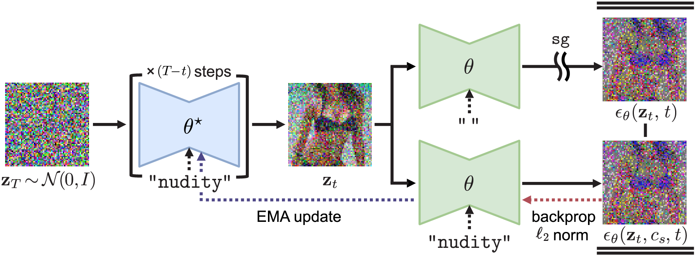

# Safe self-Distillation Diffusion (SDD)

The official implementation of the paper "Towards Safe Self-Distillation of Internet-Scale Text-to-Image Diffusion Models" (ICML 2023 Workshop on Challenges in Deployable Generative AI)



## Abstract

Large-scale image generation models, with impressive quality made possible by the vast amount of data available on the Internet, raise social concerns that these models may generate harmful or copyrighted content. The biases and harmfulness arise throughout the entire training process and are hard to completely remove, which have become significant hurdles to the safe deployment of these models. In this paper, we
propose a method called SDD to prevent problematic content generation in text-to-image diffusion models. We self-distill the diffusion model to guide the noise estimate conditioned on the target removal concept to match the unconditional one. Compared to the previous methods, our method eliminates a much greater proportion of harmful content from the generated images without degrading the overall image quality. Furthermore, our method allows the removal of multiple concepts at once, whereas previous works are limited to removing a single concept at a time.

## Pseudo-code

```python
def run_sdd(
  unet: UNet2DConditionModel, scheduler: DDIMScheduler, text_encoder: CLIPTextModel,
  concepts: List[str], n_iters: int=1500, m: float=0.999, s_g: float=3.0,
):
  unet_ema = deepcopy(unet)
  c_0, c_s = text_encoder(""), text_encoder(", ".join(concepts))
  
  for _ in range(n_iters):
    # Iterate over concepts
    c_p = text_encoder(concepts[i % len(concepts)])
    until = torch.randint((1,), 0, scheduler.total_steps-1)
    z_t = torch.randn((1, 4, 64, 64), 0, 1) # Initial Gaussian noise z_T
    
    # Sample latents z_t from the EMA model
    with torch.no_grad():
      for i, t in enumerate(scheduler.timesteps):
        e_0, e_p = unet_ema(z_t, t, c_0), unet_ema(z_t, t, c_p)
        e_tilde = e_0 + s_g * (e_p - e_0) # s_g: CFG guidance scale
        z_t = scheduler(z_t, e_tilde, t)
        if i == until:
          break
    
    # Calculate L2-norm between two noise estimates and backprop
    e_0, e_s = unet(z_t, t, c_0), unet(z_t, t, c_s)
    loss = ((e_0.detach() - e_s) ** 2).mean()
    loss.backward()
    optimizer.step()
    optimizer.zero_grad()

    # Update the teacher model with EMA
    with torch.no_grad():
      for p, q in zip(unet_ema.parameters(), unet.parameters()):
        p = m * p + (1 - m) * q # EMA update
  
  return unet_ema
```


## How to Run

### Installation

In order to minimize other dependencies and ensure generalization to other models in the future, our code runs based upon HuggingFace's Diffusers library with PyTorch. If you already installed Diffusers and Trnasformers, you are good to go! If not, it is recommended to upgrade PyTorch to version 1.13. Then, you can install required libraries as below. For further instruction, please check [https://huggingface.co/docs/diffusers/installation](https://huggingface.co/docs/diffusers/installation) and [https://huggingface.co/docs/transformers/installation](https://huggingface.co/docs/transformers/installation). You don't need the Accelerate library, but it is recommended for memory-efficient model loading and other features. For simplicity, our code does not support Accelerate's multi-GPU training features.

```bash
pip install transformers diffusers accelerate
```

### Instruction

After installation, download this repository to your local environment or `git clone` it, and move to the `safe-diffusion` directory.

You can run our method Safe self-Distillation Diffusion (SDD) with the example script.

**For Stable Diffusion 1.4:**
```bash
bash run_sdd_nudity.sh
```

**For SDXL:**
```bash
bash run_sdd_nudity_sdxl.sh
```

We re-implemented Erasing Stable Diffusion (ESD) with HuggingFace's Diffusers library, and you may run it as well. Refer to the original repository ([https://github.com/rohitgandikota/erasing](https://github.com/rohitgandikota/erasing)) and the paper ([https://arxiv.org/abs/2303.07345](https://arxiv.org/abs/2303.07345)) for more information. Please note that our code may work differently, and we welcome any suggestion or modification to it. If you have any, please send a pull request, create an issue, or email me.

**For Stable Diffusion 1.4:**
```bash
bash run_esd_nudity.sh
```

**For SDXL:**
```bash
bash run_esd_nudity_sdxl.sh
```

In order to run both methods, you need to have at least 24GB of VRAM on your GPU (RTX 3090), if you only train cross-attention layers (~5% of the total parameters). You need more VRAM if you want to try full fine-tuning. You may split load the student and the teacher model to different GPUs, but it still requires at least two GPUs with at least 16GB VRAM for fine-tuning cross-attention layers. You can fine-tune full weights with two GPUs with 24GB VRAM each.

### SDXL Support

This repository now supports [Stable Diffusion XL (SDXL)](https://huggingface.co/stabilityai/stable-diffusion-xl-base-1.0) models in addition to the original Stable Diffusion 1.4. Key differences when using SDXL:

- **Resolution**: Automatically detects and uses 1024×1024 resolution for SDXL vs 512×512 for SD 1.4
- **Dual Text Encoders**: SDXL uses two text encoders (OpenCLIP-ViT/G and CLIP-ViT/L) which are automatically handled
- **Latent Dimensions**: Uses 128×128 latent space for SDXL vs 64×64 for SD 1.4
- **Memory Requirements**: SDXL requires more VRAM due to larger model size and higher resolution
- **Model Detection**: Automatically detects SDXL models based on model name containing "xl" or "sdxl"

### Generate Images

You can generate images in batch with prompt text files or csv files. You may modify `generate.py` to customize generation. It supports SD, SDXL, SD+NEG, SLD, and SEGA, (`--pipeline_type {sd, sdxl, sld, sega, auto}`) which we used in our paper. The `auto` option automatically detects whether to use SD or SDXL based on the model name.

**For Stable Diffusion 1.4:**
```bash
python generate.py \
    --pretrained_model_name_or_path "CompVis/stable-diffusion-v1-4" \
    --pipeline_type sld --pipeline_config max \
    --prompt_path "prompts/country_body.txt" --num_images_per_prompt 10 \
    --use_fp16 --seed 42 --device "cuda:0"
```

**For SDXL:**
```bash
python generate.py \
    --pretrained_model_name_or_path "stabilityai/stable-diffusion-xl-base-1.0" \
    --pipeline_type auto \
    --image_dir "images/sdxl_test" \
    --prompt_path "prompts/country_body.txt" \
    --num_images_per_prompt 1 \
    --use_fp16 --device "cuda:0"
```

Or use the provided script:
```bash
bash generate_sdxl_example.sh
```

You may provide a fine-tuned U-Net checkpoint with an argument as follows.

```bash
--unet_path <directory-to-unet-containing-config.json>
```

## Citation

```bibtex
TO BE ADDED
```